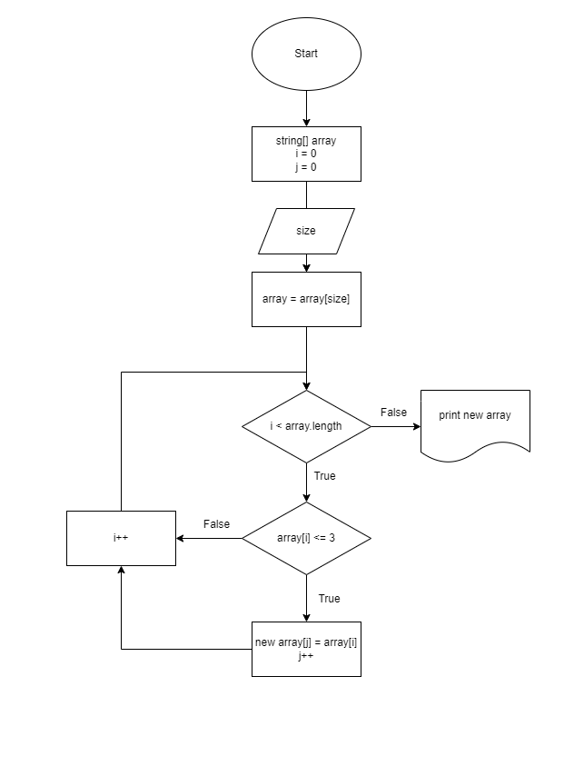

# Итоговая проверочная работа

### Задача: Написать программу, которая из имеющегося массива строк формирует новый массив из строк, длина которых меньше, либо равна 3 символам. Первоначальный массив можно ввести с клавиатуры, либо задать на старте выполнения алгоритма. При решении не рекомендуется пользоваться коллекциями, лучше обойтись исключительно массивами.

### Алгоритм выполнения итогового задания представлен в диаграмме:

* Пользователь вводит с клавиатуры строки с разным количеством символов.

* Инициализируем массив типа string.

* Создаем метод для определения размера строк:

    1.  Инициализируем переменную для счетчика и присваиваем ей нулевое значение. Переменная нужна для определения длины результирующего массива. Создаем цикл и проходим по всем элементам входного массива строк;

    2. Далее проверям количество символов в искомой строке. Если меньше или равно 3, заносим строку в новый массив. При этом увеличиваем счетчик на 1

    3. Получается новый массив, размером с исходный, в котором могут присутствовать пустые строки;

    4. Задаем массив необходимой длины. Создаем цикл, в котором будем присваивать результирующему массиву значения выведенные из предыдущего цикла.

## При помощи следующего метода выводим на экран итоговый массив.

